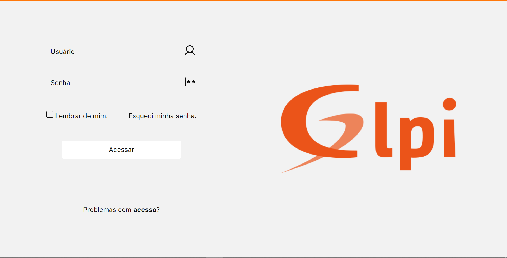
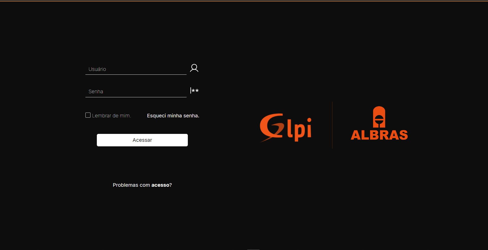
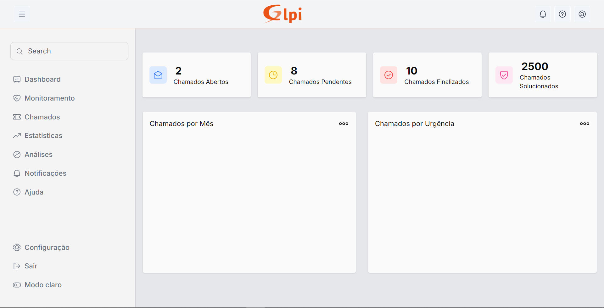

# GLPI Technical Analysis System

Este projeto visa fornecer uma plataforma de análise técnica para o GLPI, oferecendo estatísticas detalhadas, dashboards interativos e gráficos informativos. Inicialmente direcionado para técnicos, com potencial de expansão para incluir clientes.

## Tecnologias Utilizadas

- Node.js/TypeScript/Fastify para o backend
- MySQL (MariaDB) para armazenamento de dados
- ReactJS/TypeScript para o frontend

## Funcionalidades

- **Estatísticas Avançadas**: Visualização detalhada de métricas de desempenho e uso da plataforma GLPI.
- **Dashboards Interativos**: Painéis personalizáveis para monitoramento em tempo real.
- **Gráficos Dinâmicos**: Representação visual de dados por meio de gráficos interativos.
- **Histórico de Atividades**: Registro e análise do histórico de interações e tickets.
- **Acesso Diferenciado**: Funcionalidades separadas para técnicos e clientes, com perspectiva de usuário única.

## Estrutura do Projeto

- **`/backend`**: Contém o código do servidor Node.js com Fastify e TypeScript.
- **`/frontend`**: Aplicação ReactJS com phosphor-react para a interface do usuário.
- **`/database`**: Scripts SQL e configurações relacionadas ao banco de dados MariaDB.

## Como Utilizar

1. **Configuração do Ambiente**:
   - Clone o repositório.
   - Instale as dependências do Node.js tanto para o backend quanto para o frontend.
   - Execute `npm install` para instalar as dependências.

2. **Configuração do Banco de Dados**:
   - Configure o MariaDB com as credenciais apropriadas de acesso ao Banco do GLPI.

3. **Execução do Backend**:
   - Navegue até o diretório `/api-rest-GLPI`.
   - Execute `npm run dev` para iniciar o servidor.

4. **Execução do Frontend**:
   - Navegue até o diretório `/GLPI-Analytics-Pro`.
   - Execute `npm run dev` para iniciar a aplicação React.

5. **Acesso à Aplicação**:
   - Abra o navegador e vá para `http://localhost:5173` para acessar a interface do usuário.

## Contribuição

Contribuições são bem-vindas! Sinta-se à vontade para enviar pull requests para melhorar o projeto.

## Autor

Desenvolvido por [Henrique Maximo](https://github.com/Henrry-Maximo)
